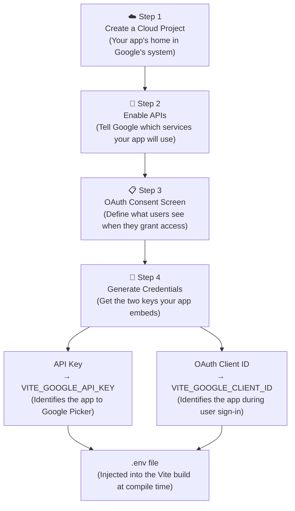
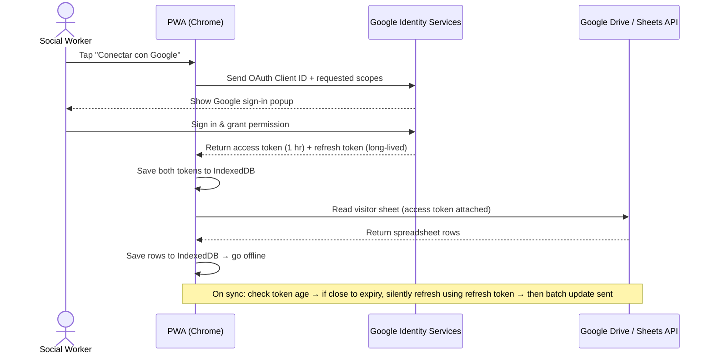

# Google Cloud Console Setup Guide

> **Security notice:** Never paste real API keys, Client IDs, or Client Secrets into this file. Store them exclusively in your local `.env` file, which is excluded from version control by `.gitignore`.

---

## Why does this app need Google Cloud at all?

This PWA reads a visitor list from a Google Sheet and writes attendance back to it. Google does not let any random website touch a user's Drive files — it requires your app to be **registered** and the user to explicitly **grant permission**. That registration happens in Google Cloud Console, and it involves four sequential setup steps.



---

## Understanding OAuth Token Expiration & Silent Refresh

### The 1-Hour Hard Limit

Google's OAuth 2.0 access tokens **always expire after exactly 1 hour (3600 seconds)**. This is not configurable — it's a security standard across all Google APIs. No amount of configuration in the console can change this.

### Why expiration is good UX if handled properly

Rather than storing static credentials (which would be a security nightmare), short-lived tokens force the app to "check in" regularly with Google, preventing compromised tokens from being abused indefinitely.

### Silent Refresh for Seamless Experience

When the user signs in, Google returns **two** tokens:
- **Access Token** (1 hour) — use this for Drive / Sheets API calls
- **Refresh Token** (long-lived) — use this to get a *new* access token without the user re-authenticating

**Implementation strategy:**
1. Store both tokens in IndexedDB when the user first signs in
2. Before each Drive / Sheets API call, check the token age
3. If the access token is close to expiry (e.g., older than 50 minutes), silently call Google with the refresh token to get a new one
4. The user never sees a sign-in dialog — they just keep working

This gives you the best of both worlds: short-lived tokens are secure, but the user experience is seamless because refresh happens invisibly in the background.

### Emergency Re-authentication (Fallback)

If the refresh token itself expires or is revoked (rare, but possible after a very long offline period or if the user manually disconnected the app in their Google Account settings), the app should detect the 401/403 error and ask the user to sign in again via the **"CONECTAR CON GOOGLE"** button.

---

Once the keys are in the build, here is what happens when a social worker opens the app and taps "Conectar con Google":



---

## Step 1 — Create a Cloud Project

**Why:** Google Cloud organizes everything (APIs, keys, users) under a *Project*. Think of it as a folder that owns your app's identity. Without a project, you cannot create credentials.

**Who should own it:** Use your personal `@gmail.com` account. You can add collaborators later via IAM (see [Sharing the project](#sharing-the-project-with-other-google-users)).

1. Open [console.cloud.google.com](https://console.cloud.google.com/) and sign in with your personal Google account.
2. Click the project dropdown in the top navigation bar → **"New Project"**.
3. Set the following:
   * **Project Name:** `social-worker-checkin-pilot`
   * **Organization / Location:** Leave as *No Organization* (personal account projects don't have one).
4. Click **Create**. Wait for the notification confirming the project is ready, then make sure it is selected in the top bar.

---

## Step 2 — Enable the Required APIs

**Why:** Google APIs are opt-in. Even though your project exists, no service is active until you explicitly turn it on. The app uses three services: Drive (to copy files), Sheets (to read/write rows), and Picker (to show the file browser UI).

1. Go to **APIs & Services** → **Library**.
2. Search for and **Enable** each of these, one at a time:
   | API | Why the app needs it |
   |---|---|
   | **Google Drive API** | Duplicate the master sheet into a working copy; read file metadata |
   | **Google Sheets API** | Download visitor rows; batch-write attendance back |
   | **Google Picker API** | Render the visual Drive file-selection dialog |

---

## Step 3 — Configure the OAuth Consent Screen

**Why:** Before Google issues your app a token, it shows the user a consent dialog — *"Control de Asistencia wants to access your Google Drive files."* This step defines what that dialog says and which users are allowed through.

1. Go to **APIs & Services** → **OAuth consent screen**.
2. **User Type:**
   * Select **External** (required for personal `@gmail.com` accounts).
   * This puts the app in *Testing* mode, which is fine for the pilot. Only emails on your test list can sign in.
3. Fill in **App Information:**
   * **App name:** `Control de Asistencia`
   * **User support email:** your personal Gmail
   * **Developer contact email:** your personal Gmail
4. **Authorized domains:** Add `github.io` — this tells Google that requests coming from `*.github.io` are legitimate origins for this app.
5. Click **Save and Continue** to reach **Scopes**. Click **Add or Remove Scopes** and add:
   * `https://www.googleapis.com/auth/drive.file` — app can only see files it opened or created (not your full Drive)
   * `https://www.googleapis.com/auth/spreadsheets` — read and write spreadsheet data
6. Click **Save and Continue**, then on the **Test Users** screen add every `@gmail.com` address that will use the app during the pilot.

---

## Step 4 — Generate Credentials

**Why:** This is where you get the two strings your app actually embeds. The **API Key** is a static token that authenticates the *app itself* to the Picker service (no user login required). The **OAuth Client ID** is used during the user sign-in flow to tell Google *which registered app* is requesting a token.

> **Refresh Token Note:** When the JavaScript code calls Google's token endpoint with the correct scopes (see Step 3), Google automatically includes a **refresh token** in the response. This is handled by the front-end code using `initTokenClient()`, not by the console configuration. Your code should store both the `access_token` (for API calls) and the `refresh_token` (for silent refresh).

### A. API Key (for Google Picker)

1. Go to **APIs & Services** → **Credentials** → **+ Create Credentials** → **API key**.
2. Copy the generated string. This is your `VITE_GOOGLE_API_KEY`.
3. Immediately click **Edit API key** (or **Restrict Key**) and:
   * Under *API restrictions*, select **Restrict key** → choose **Google Picker API**.
   * This ensures the key is useless if leaked, because it can only call Picker — nothing else.
4. Click **Save**.

### B. OAuth 2.0 Client ID (for user sign-in)

1. On the same **Credentials** screen → **+ Create Credentials** → **OAuth client ID**.
2. **Application type:** `Web application`
3. **Name:** `PWA Production Client`
4. **Authorized JavaScript origins** — this is the security gate that answers *"which URLs are allowed to trigger a Google sign-in using this Client ID?"* Add both:
   * `http://localhost:5173` (Vite's default local dev port)
   * `https://[your-github-username].github.io` (production URL)
5. Leave **Authorized redirect URIs** empty — the PWA uses a pop-up flow, not a redirect.
6. Click **Create**. Copy the **Client ID** string. This is your `VITE_GOOGLE_CLIENT_ID`.

> The **Client Secret** shown here is not used by this PWA (it is only for server-side OAuth flows). Do not store it anywhere in this project.

---

## Step 5 — Store Credentials in Your Local `.env` File

Create a `.env` file in the project root (it is already in `.gitignore` — never commit it):

```env
# Local only — never commit this file
VITE_GOOGLE_API_KEY="paste-your-api-key-here"
VITE_GOOGLE_CLIENT_ID="paste-your-client-id-here"
```

Vite automatically injects any `VITE_` prefixed variable into the client bundle at build time. The app reads them via `import.meta.env.VITE_GOOGLE_API_KEY`.

---

## Sharing the Project with Other Google Users

If a colleague needs to manage the Cloud Console project (update credentials, add test users, etc.) you can grant them access via IAM without giving them your Google account password.

1. In Google Cloud Console, go to **IAM & Admin** → **IAM**.
2. Click **Grant Access**.
3. Enter their `@gmail.com` address.
4. Assign a role:
   | Role | What they can do |
   |---|---|
   | **Owner** | Full control including deleting the project and managing IAM itself. Use only for a trusted admin. |
   | **Editor** | Manage APIs, credentials, and all resources. Cannot change IAM. Recommended for co-developers. |
   | **Viewer** | Read-only access to the console. |
5. Click **Save**.

> Adding someone here grants Cloud Console access only. To let them *use the app* during the pilot, also add their email under **OAuth consent screen → Test users**.

---

## Quick Reference Checklist

- [ ] Cloud project created with personal Google account
- [ ] Google Drive API enabled
- [ ] Google Sheets API enabled
- [ ] Google Picker API enabled
- [ ] OAuth consent screen configured (External, Testing mode)
- [ ] `github.io` added as an authorized domain
- [ ] Scopes `drive.file` and `spreadsheets` added
- [ ] Pilot user emails added to Test Users list
- [ ] API Key generated and restricted to Google Picker API only
- [ ] OAuth Client ID generated with correct JavaScript origins
- [ ] Credentials saved to local `.env` file (never committed)
- [ ] **Code Implementation:** JavaScript code includes logic to request, store, and silently refresh tokens before expiry